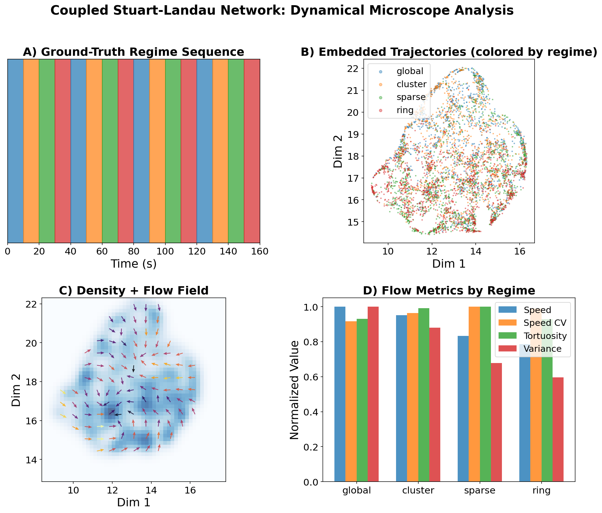
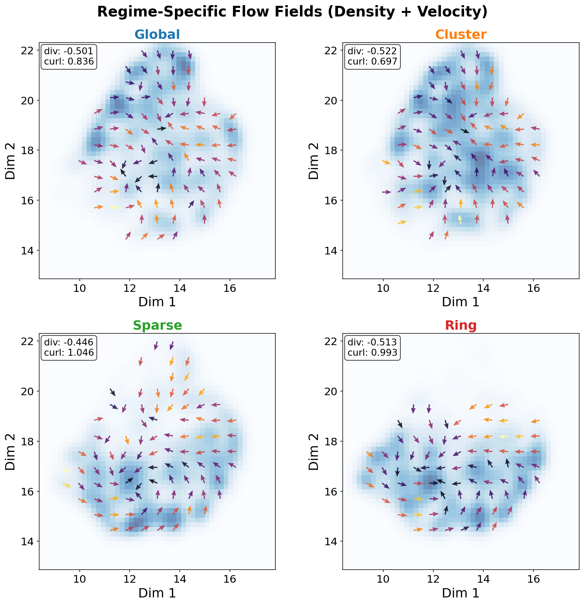
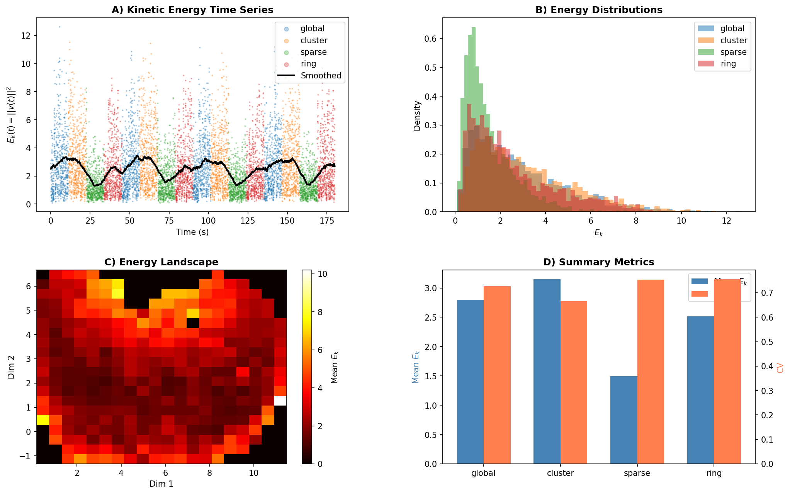

# FlowPrint

[](https://github.com/furmanlukasz/flowprint/actions/workflows/ci.yml)
[](https://www.python.org/downloads/)
[](https://opensource.org/licenses/MIT)
[](https://codespaces.new/furmanlukasz/flowprint)

**Flow-based fingerprints of dynamical regimes on shared manifolds.**

FlowPrint is a framework for characterizing dynamical regimes in multivariate time series using latent trajectories, flow fields, and geometric fingerprints—rather than discrete state labels.

## Overview

Traditional methods for analyzing multivariate oscillatory signals often reduce dynamics to discrete states (microstates, HMM states) and compare occupancy statistics. FlowPrint takes a complementary approach: it treats the signal as a continuous trajectory evolving on a learned manifold and characterizes regimes by *how* the system moves, not just *where* it visits.

Key features:
- **Coupled Stuart-Landau oscillator simulation** with topology-switching for ground-truth validation
- **Flow field estimation** on learned latent representations
- **Trajectory-based metrics**: speed, tortuosity, explored variance, kinetic energy
- **Discriminability analysis** using ANOVA with effect sizes (η²)

## Workflow

<p align="center">

</p>

## Example Figures

<table>
<tr>
<td width="50%">

<p align="center"><em>UMAP embedding, flow fields, and metrics by regime</em></p>
</td>
<td width="50%">

<p align="center"><em>Regime discriminability with η² effect sizes</em></p>
</td>
</tr>
<tr>
<td width="50%">

<p align="center"><em>Regime-specific flow field patterns</em></p>
</td>
<td width="50%">

<p align="center"><em>Latent kinetic energy as dynamical activity proxy</em></p>
</td>
</tr>
</table>

## Installation

### Using UV (Recommended)

[UV](https://github.com/astral-sh/uv) is a fast Python package manager. Install it first if you haven't:

```bash
# Install UV
curl -LsSf https://astral.sh/uv/install.sh | sh
```

Then install FlowPrint:

```bash
# Clone and install
git clone https://github.com/furmanlukasz/flowprint.git
cd flowprint
uv sync

# Run with UV
uv run python examples/reproduce_figures.py --output-dir figures/

# Or activate the virtual environment
source .venv/bin/activate
python examples/reproduce_figures.py --output-dir figures/
```

With development dependencies:

```bash
uv sync --all-extras
```

### Using pip

```bash
# Clone and install
git clone https://github.com/furmanlukasz/flowprint.git
cd flowprint
pip install -e .

# With development dependencies
pip install -e ".[dev]"
```

### Using GitHub Codespaces (Easiest)

Click the button below to open the project in a pre-configured development environment:

[](https://codespaces.new/furmanlukasz/flowprint)

The Codespace will automatically:
- Set up Python 3.11 environment
- Install UV package manager
- Install all dependencies via `uv sync --all-extras`

Once the Codespace is ready, you can immediately run:

```bash
# Reproduce all figures from the paper
uv run python examples/reproduce_figures.py --output-dir output/

# Or run tests
uv run pytest tests/ -v
```

All dependencies (NumPy, SciPy, UMAP, etc.) are pre-installed and ready to use.

## Quick Start

```python
from flowprint import CoupledStuartLandauNetwork
from flowprint.metrics import compute_flow_metrics
from flowprint.visualization import plot_electrode_timeseries

# Generate simulation with topology-switching
net = CoupledStuartLandauNetwork(n_oscillators=30, n_channels=30, seed=42)
net.default_topologies()

result = net.generate(
    total_duration_s=160.0,
    coupling_strength=5.0,
    transition_s=0.3,
)

# Visualize raw observations
fig = plot_electrode_timeseries(
    result.y, result.t, result.switch_times,
    sfreq=result.params["sfreq"],
    time_window=(0, 60),
)
fig.savefig("electrode_timeseries.png")

print(f"Simulated {result.y.shape[1]/result.params['sfreq']:.0f}s of data")
print(f"Regimes: {list(dict.fromkeys(result.regime_names))}")
```

## Reproducing Paper Figures

The `examples/reproduce_figures.py` script regenerates all figures from the paper:

```bash
# With UV
uv run python examples/reproduce_figures.py --output-dir figures/

# With pip (after installation)
python examples/reproduce_figures.py --output-dir figures/
```

This will generate:
- `fig_electrode_timeseries.png` - Raw observations with regime switches
- `fig_analysis_main.png` - Main 4-panel analysis figure
- `fig_flow_fields.png` - Regime-specific flow fields
- `fig_discriminability.png` - Violin plots with effect sizes
- `fig_kinetic_energy.png` - Kinetic energy analysis

## Module Structure

```
flowprint/
├── simulation/           # Coupled oscillator network
│   ├── coupled_oscillators.py
│   ├── topologies.py
│   └── noise.py
├── metrics/             # Flow and trajectory metrics
│   ├── flow_metrics.py
│   ├── kinetic_energy.py
│   └── discriminability.py
└── visualization/       # Figure generation
    └── figures.py
```

## Key Concepts

### Simulation

The `CoupledStuartLandauNetwork` implements a network of coupled limit-cycle oscillators with switchable coupling topology:

- **Global**: All-to-all coupling → promotes full synchronization
- **Cluster**: Modular coupling → multi-cluster synchrony
- **Sparse**: Random sparse coupling → promotes desynchronization
- **Ring**: Directional ring → traveling wave patterns

### Flow Metrics

Computed from latent trajectories:

| Metric | Description | Discriminability |
|--------|-------------|------------------|
| Speed | Mean velocity magnitude | High (η² > 0.5) |
| Explored Variance | State-space coverage | High (η² > 0.5) |
| Tortuosity | Path curvature | Low for topology contrast |
| Kinetic Energy | \|\|v\|\|² intermittency proxy | Medium (η² ~ 0.2) |

### Discriminability

Uses one-way ANOVA with eta-squared (η²) effect size:
- η² > 0.14: Large effect
- 0.06 < η² < 0.14: Medium effect
- η² < 0.06: Small effect

## Running Tests

```bash
# Run all tests
uv run pytest tests/ -v

# Run fast tests only
uv run pytest tests/test_simulation.py tests/test_metrics.py -v

# Run with coverage
uv run pytest tests/ --cov=flowprint --cov-report=term-missing
```

## Citation

If you use FlowPrint in your research, please cite:

```bibtex
@article{furman2026dynamical,
  title={A Dynamical Microscope for Multivariate Oscillatory Signals:
         Validating Regime Recovery on Shared Manifolds},
  author={Furman, Łukasz and Minati, Ludovico and Duch, Włodzisław},
  journal={TBA},
  year={2026}
}
```

## License

MIT License - see [LICENSE](LICENSE) for details.
